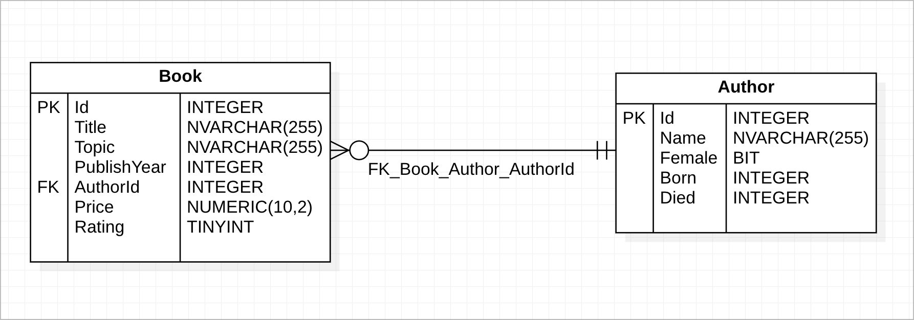

# Before you get started

-   How to install Visual Studio: https://docs.microsoft.com/en-us/visualstudio/install/install-visual-studio?view=vs-2022
-   Install Dotnet SDK (.Net 6): https://dotnet.microsoft.com/en-us/download/dotnet/6.0
-   Get familiar with Visual Studio: https://visualstudio.microsoft.com/vs/getting-started/
    https://www.youtube.com/watch?v=1CgsMtUmVgs
-   How to use git: https://try.github.io/levels/1/challenges/1
-   API Testing with Postman: https://www.blazemeter.com/blog/how-use-postman-manage-and-execute-your-apis

# Build your first Asp.Net Core API

This test is designed for students who haven't learnt AspNet.Core Web API before or just know little things about AspNet.Core Web API.

**Duration: 1 week.**

## Requirements:

We need to build an application to manage book in the library. Complete the list of items bellow to pass the challenges !!! ⚔️⚔️⚔️

-   [ ] Create a web API project.
-   [ ] Add a model class and a database context. use `InMemory` database for testing purposes
-   [ ] Seeding default data ([list here](data-seeding.md))
-   [ ] Scaffold a controller with CRUD methods.
-   [ ] Configure routing, URL paths, and return values.
-   [ ] Call the web API with Postman.
-   [ ] Use GitHub to manage source code

The following diagram shows the model of the app.

Create the following APIs:

| Method | API             | Description                                                             | Response body                         | Example                   |
| ------ | --------------- | ----------------------------------------------------------------------- | ------------------------------------- | ------------------------- |
| GET    | /api/books      | Get all books (Supports filtering by AuthorId, Rating, and PublishYear) | Array of book items                   | [detail](sample-request.md#Get-list-book) |
| GET    | /api/books/{id} | Get an item by ID                                                       | Book item                             | [detail](sample-request.md#Get-detail-book) 
| POST   | /api/books      | Add a new item                                                          | Book item                             | [detail](sample-request.md#Create-book) 
| PUT    | /api/books/{id} | Update an existing item                                                 | None                                  | [detail](sample-request.md#Update-book) 
| DELETE | /api/books/{id} | Delete an item                                                          | None                                  | [detail](sample-request.md#Delete-book) 
| GET    | /api/authors    | Get list of author                                                      | Array of authors with number of books | [detail](sample-request.md#Get-authors ) 

---

> ## Extra work
>
> Add user identity and apply login with JWT

# References

[Create your first AspNet.core api](https://docs.microsoft.com/en-us/aspnet/core/tutorials/first-web-api?view=aspnetcore-6.0&tabs=visual-studio)
